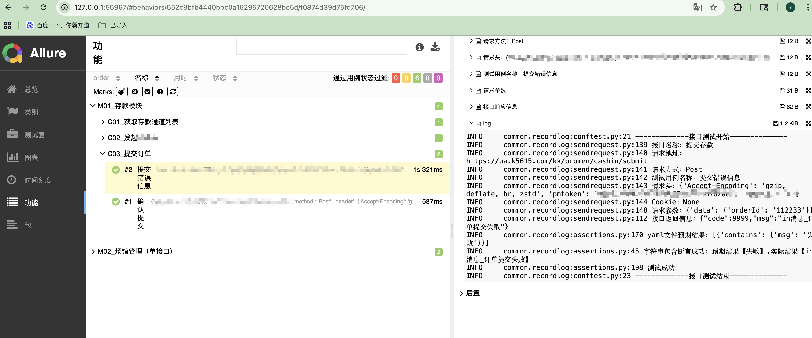

框架结构
- base 基础类封装，测试用例工具
- common  公共方法封装
- conf  存放全局配置文件目录
- data  存放测试数据路径
- logs  存放测试日志目录
- report    测试报告生成目录，目前支持生成两种形式的报告
- testcase  存放测试用例文件目录
- venv  本框架使用的虚拟环境
- conftest.py 全局操作，名称是固定写法不可更改
- environment.xml allure测试报告总览-环境显示内容
- extract.yaml 接口依赖参数存放文件
- pytest.ini pytest框架规范约束，名称是固定写法不可更改
- requirements.txt 本框架所使用的到的第三方库
- run.py 主程序入口
- dockerfile与jenkinsfile自由写 不上传

运行截图
